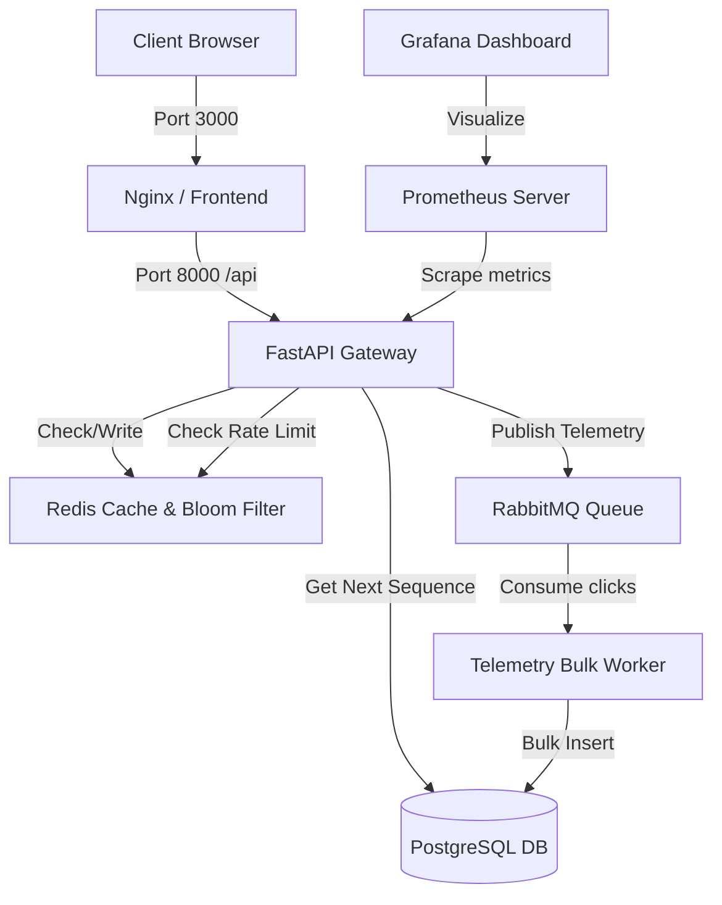

# Scalable URL Shortener & Telemetry Pipeline

A high-performance, containerized URL Shortener and click telemetry pipeline built using modern system design patterns. Designed for sub-millisecond redirection speeds, rate-limiting security, and real-time analytical insights.

---

## 🏗️ System Architecture

The application is composed of several decoupled services, optimized for write and read performance:



### 🔹 Redirection (Fast Path)
* **Redis Caching:** Standard key-value caching for instant redirects.
* **Bloom Filter:** A Redis-backed Bloom Filter checks for token existence before hitting the database on a cache miss. This prevents **Database Scraping attacks** and useless lookups.
* **Async Telemetry:** Click statistics (IP, User Agent, Time) are instantly published to RabbitMQ so redirection is not blocked by database write latency.

### 🔹 Shortening (Write Path)
* **Rate Limiting:** Enforces a sliding-window rate limit (10 writes/min) using Redis.
* **ID Generation:** Pulls IDs from a PostgreSQL sequence and encodes them using **Base62 encoding** to generate short tokens.

### 🔹 Background Processing
* **Bulk Telemetry Worker:** Consumes click telemetry events from RabbitMQ and bulk-inserts them into PostgreSQL in batches (or every 2 seconds) to minimize database transactions.

---

## 🚀 Getting Started

### Prerequisites
Make sure you have **Docker Desktop** installed and running on your system.

### Running the Application
Spin up the entire stack with a single command from the project root:

```bash
docker compose up --build -d
```

This starts all 8 services in the background. Once the build completes, the services will be available at:

| Service | Address | Credentials |
| :--- | :--- | :--- |
| **Frontend Dashboard** | [http://localhost:3000](http://localhost:3000) | *None* |
| **Backend API Gateway** | [http://localhost:8000](http://localhost:8000) | *None* |
| **Grafana Observability** | [http://localhost:3001](http://localhost:3001) | `admin` / `admin` |
| **RabbitMQ Management** | [http://localhost:15672](http://localhost:15672) | `guest` / `guest` |
| **Prometheus Metrics** | [http://localhost:9090](http://localhost:9090) | *None* |

---

## 🔌 API Reference

### 1. Shorten a URL
* **Endpoint:** `POST /api/v1/shorten`
* **Request Body:**
  ```json
  {
    "long_url": "https://example.com/very/long/path/to/destination",
    "expires_at": "2026-12-31T23:59:59Z" 
  }
  ```
  *(Note: `expires_at` is optional)*
* **Response:**
  ```json
  {
    "short_token": "d",
    "short_url": "http://localhost:3000/api/v1/redirect/d",
    "long_url": "https://example.com/very/long/path/to/destination",
    "created_at": "2026-06-17T19:11:00Z",
    "expires_at": "2026-12-31T23:59:59Z"
  }
  ```

### 2. Redirect Token
* **Endpoint:** `GET /api/v1/redirect/{short_token}`
* **Description:** Performs a HTTP 302 redirect to the destination URL.

### 3. Retrieve Link Analytics
* **Endpoint:** `GET /api/v1/analytics/{short_token}`
* **Description:** Retrieves total clicks, 30-day timeline clicks, and geographic click distribution for a specific link.

### 4. Global Dashboard Analytics
* **Endpoint:** `GET /api/v1/analytics`
* **Description:** Aggregates statistics across all shortened links.

---

## 🛠️ Running Tests
To run unit and integration tests for the FastAPI backend locally inside the container environment:

```bash
docker compose exec backend python -m unittest tests/test_backend.py
```
